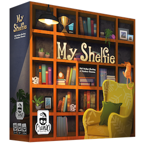

# Progetto INGSW 2022-2023

Game Implementation [My Shelfie](https://www.craniocreations.it/prodotto/my-shelfie/)

### Group GC25 Components:
- [Jonel Relucio](https://github.com/jonelrelucio)
- [Dalila Samr](https://github.com/DalilaPolimi)
- [Lucian Sas](https://github.com/LucianSasPolimi) 
- [Alessandro Petruzzelli](https://github.com/AlessandroPetruzzelli) 

### Diagramma UML
UML Diagrams have been develped using [diagrams](https://www.diagrams.net/).  
Main UML Diagram: [UML Diagram](src/deliverables/umlDiagram/ClassDiagram_Model.png)

### Functionality
| Functionality                | State |
|:-----------------------------|:-----:|
| Basic rules                  |  🟢   |
| Complete rules               |  🟢   |
| RMI                          |  🟢   |
| Socket                       |  🟢   |
| CLI                          |  🟢   |
| GUI                          |  🟡   |
| Multiple games               |  🔴   |
| Persistence                  |  🔴   |
| Resilience to disconnections |  🔴   |
| Chat                         |  🟢   |

##### Legend
🔴 Not Implemented | 🟢 Implemented |🟡 Being Implemented...

