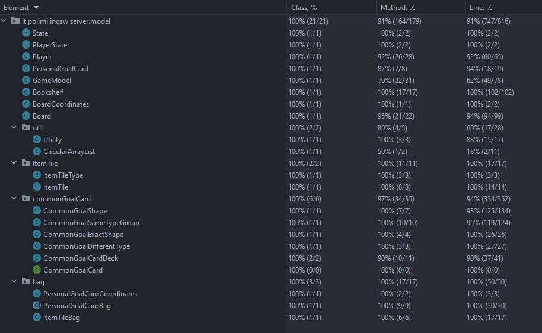

# Progetto INGSW 2022-2023

Game Implementation [My Shelfie](https://www.craniocreations.it/prodotto/my-shelfie/)


### Group GC25 Components:
- [Jonel Relucio](https://github.com/jonelrelucio)
- [Dalila Samr](https://github.com/DalilaPolimi)
- [Lucian Sas](https://github.com/LucianSasPolimi) 
- [Alessandro Petruzzelli](https://github.com/AlessandroPetruzzelli) 

### Dependencies
- Gson: used for serialization and deserialization of certain class objects
- JavaFX: used for the GUI Implementation


### Functionality
| Functionality                | State |
|:-----------------------------|:-----:|
| Basic rules                  |  🟢   |
| Complete rules               |  🟢   |
| RMI                          |  🟢   |
| Socket                       |  🟢   |
| CLI                          |  🟢   |
| GUI                          |  🟢   |
| Multiple games               |  🔴   |
| Persistence                  |  🔴   |
| Resilience to disconnections |  🔴   |
| Chat                         |  🟢   |


##### Legend
🔴 Not Implemented | 🟢 Implemented |🟡 Being Implemented...

### Test coverages
These are the test coverages


### How to run the jar files
Before running either server-softeng-gc25.jar or client-softeng-gc25.jar be sure to have disabled the firewall for both of them.

##### Server
To run the server run the command in the terminal:
```
$ java -Djava.rmi.server.hostname=serverIp -jar server-softeng-gc25.jar
```
where serverIp is the IP Address of the server.
When the server is running, choose the id (int value) that corresponds to the serverIp used running the jar file.
Be sure to not select local host.


##### Client
To run the client run the command in the terminal:
```
$ java -jar client-softeng-gc25.jar
```
when the client is running, set the ip address of the server interface.
Be sure to select the correct IP Address of the server where the game is running, otherwise the client will have to be restarted.
Then select the id (int value) that corresponds to the ip address of your chosen Network Interface


##### NOTE
NOTE: My Shelfie is a board game developed and published by Cranio Creations Srl. The graphic contents of this project attributable to the board publishing product are used with the prior approval of Cranio Creations Srl for educational purposes only. The distribution, copying or reproduction of the contents and images in any form outside the project is prohibited, as is the redistribution and publication of the contents and images for purposes other than those mentioned above. Furthermore, commercial use of the aforementioned contents is prohibited.

NOTA: My Shelfie è un gioco da tavolo sviluppato ed edito da Cranio Creations Srl. I contenuti grafici di questo progetto riconducibili al prodotto editoriale da tavolo sono utilizzati previa approvazione di Cranio Creations Srl a solo scopo didattico. È vietata la distribuzione, la copia o la riproduzione dei contenuti e immagini in qualsiasi forma al di fuori del progetto, così come la redistribuzione e la pubblicazione dei contenuti e immagini a fini diversi da quello sopracitato. È inoltre vietato l'utilizzo commerciale di suddetti contenuti.


